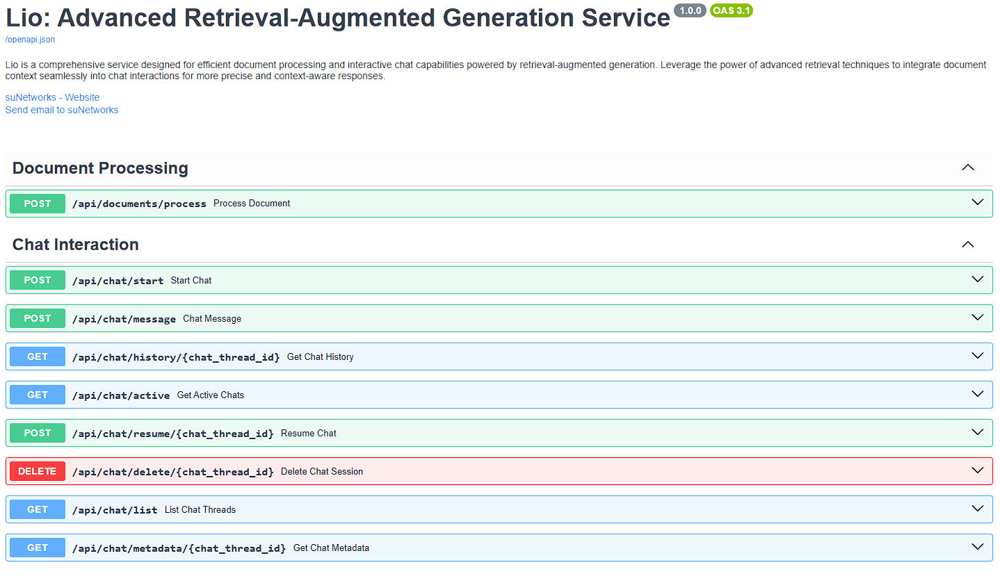

# 🚀 Lio

Lio is a comprehensive service designed for efficient document processing and interactive chat capabilities powered by retrieval-augmented generation. Leverage the power of advanced retrieval techniques to integrate document context seamlessly into chat interactions for more precise and context-aware responses.

## 📑 Table of Contents
- [🎯 Prerequisites](#prerequisites)
- [⚙️ Setup and Installation](#setup-and-installation)
- [▶️ Running the Application](#running-the-application)
- [👷 Running Background Workers](#running-background-workers)
- [🏗️ Project Structure](#project-structure)

## 🎯 Prerequisites
Ensure you have the following installed on your system:
- 🐍 **Python 3.12.x**
- 📦 **PDM** (Python Dependency Management)
- 🐳 **Docker** for running Redis 

## ⚙️ Setup and Installation

### 📥 Step 1: Install PDM 
PDM is used to manage Python dependencies. Run the following command to install PDM if it's not already installed:
```bash
pip install pdm
```

### 📦 Step 2: Install Project Dependencies
Navigate to your project directory and run:
```bash
pdm install
```

This command will create a virtual environment and install the dependencies listed in `pyproject.toml`.

### 🐳 Step 3: Start Redis Using Docker
Run the following commands to start Redis and Qdrant services:

**Start Redis:**
```bash
docker run --name redis_container -p 6379:6379 -d redis:latest
```

These commands will download the Redis and Qdrant images (if not already available) and start the containers.

### 🔑 Step 4: Create a `.env` File
Create a `.env` file in the root directory to set environment variables:
```env
QDRANT_HOST=localhost
QDRANT_PORT=6333
COHERE_API_KEY=your_cohere_api_key
OPENAI_API_KEY=your_openai_api_key
```

## ▶️ Running the Application

### 🚀 Run the FastAPI Main Application
Use PDM to start the FastAPI server:
```bash
pdm run uvicorn app.main:app --host 0.0.0.0 --port 8000
```

This command runs your FastAPI application, which can be accessed at [http://localhost:8000](http://localhost:8000).

## 👷 Running Background Workers

### ⚡ Run Dramatiq Workers
Dramatiq is used for background tasks. Start the workers using:
```bash
pdm run dramatiq app.workers
```

This command starts the Dramatiq worker processes for handling background tasks.

---

## 📝 End Notes

### 🔍 Quick Troubleshooting Guide
- ❌ If PDM install fails:
  ```bash
  pdm install --no-lock
  ```
- 🔄 If Redis container fails:
  ```bash
  docker restart redis_container
  ```
- 💡 Check logs with:
  ```bash
  docker logs redis_container
  ```

## 📷 Screenshots:
